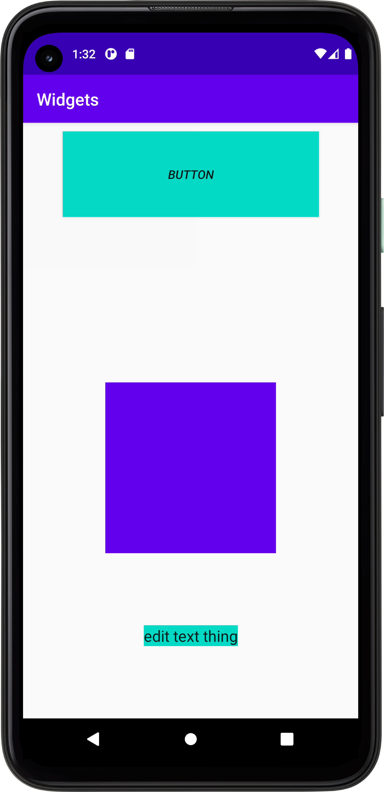

# Rapport

Det fanns redan en constrain layout så jag jobbade vidare med den istället för att byta ut den mot en linearlayout.

Efter det lade jag till en Button, EditText och en ImageView. Detta gjordes genom att lägga till följande kod i `activity_main.xml`

```
<Button

        android:layout_width="300dp"
        android:layout_height="100dp"
        />

<ImageView

        android:layout_width="200dp"
        android:layout_height="200dp"
       />

<EditText

        android:layout_width="wrap_content"
        android:layout_height="wrap_content"
       />
```

Efter detta lades constraint till samt margins, jag ändrade och lekte lite med storlek och färg på de olika widgetterna.
Ett exempel på detta är min knapp
som efter alla ändringar har koden:

```
<Button
        android:id="@+id/button"
        android:layout_width="300dp"
        android:layout_height="100dp"
        android:layout_margin="10dp"
        android:background="@color/colorAccent"
        android:text="Button"
        android:textStyle="italic"
        app:layout_constraintEnd_toEndOf="parent"
        app:layout_constraintStart_toStartOf="parent"
        app:layout_constraintTop_toTopOf="parent" />
```
Där storleken på kanppen är 300 x 400 och margin är 10 så den är 10dp från kanten. Ändrade bakgrundsfärg och satte knappens
text till "Button". Ändrade stilen till kursivt och satte constraints så att den sitter högst upp och mellan sidorna.



